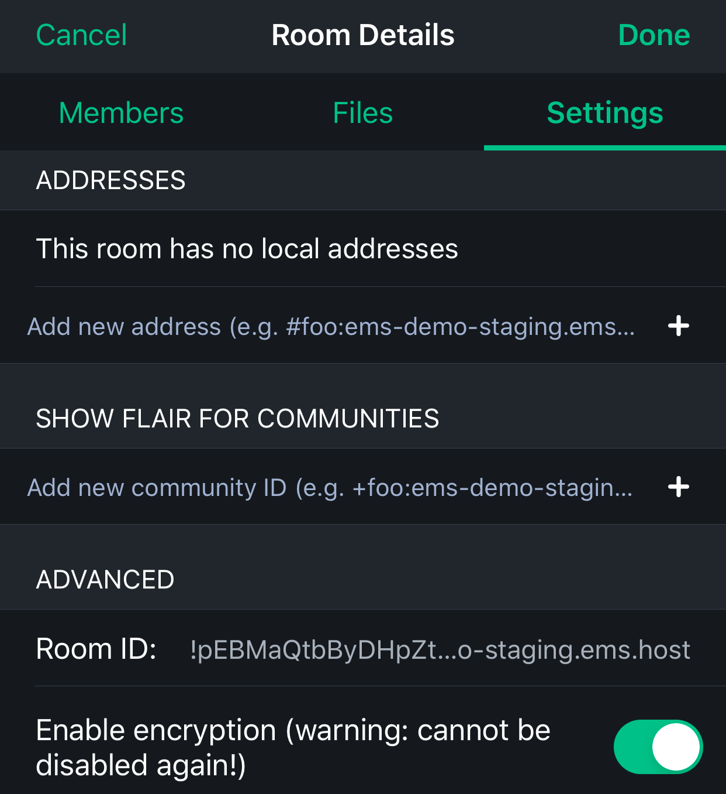
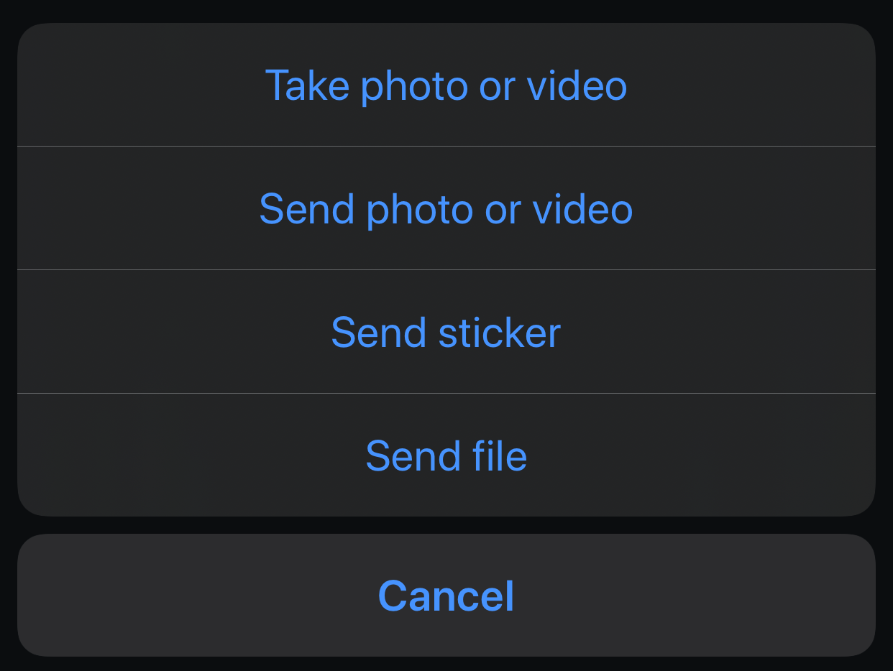
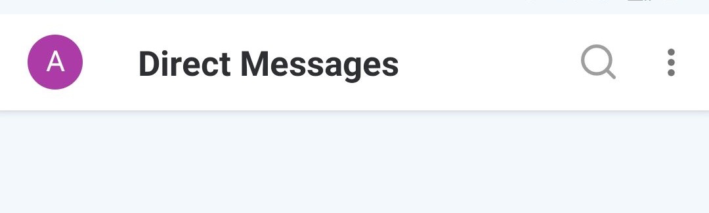

# Export and Import E2E Room Keys <!-- omit in toc -->

This article is licensed under the standard MIT license. See [[Home]] for a full copy.

# Table of Contents
<!-- TOC depthfrom:1-->

- [Table of Contents](#table-of-contents)
- [Element Web and Desktop](#element-web-and-desktop)
  - [Export Web](#export-web)
  - [Import Web](#import-web)
- [Element iOS](#element-ios)
  - [Export iOS](#export-ios)
  - [Import iOS](#import-ios)
- [Element and RiotX Android](#element-and-riotx-android)
  - [Export Android](#export-android)
  - [Import Android](#import-android)

<!-- /TOC -->

# Element Web and Desktop

## Export Web
1. Go to Element `Security & Privacy` settings  

1. Click `Export E2E room keys`  

1. Enter a secure passphrase and click `Export`  

1. Choose to save the file  

1. Select a directory on your computer  

## Import Web
1. Go to Element `Security & Privacy` settings  

1. Click `Import E2E room keys`  

1. Click `Browse`  

1. Select your export  

1. Enter your passphrase and click `Import`  

# Element iOS

## Export iOS

1. Tap the cog in the top left of Element  

1. Tap `Security`  

1. Tap `Export keys manually`  

1. Enter a secure passphrase and tap `Export`  

1. Choose `Save to Files`  

1. Choose a location then tap `Save`  

## Import iOS

This is a temporary solution until [this issue](https://github.com/vector-im/element-ios/issues/1027) is resolved

1. Tap the `+` in the bottom right corner  

1. Tap `Create room`  

1. Tap the room name (Empty room) at the top  

1. Tap the room name again  

1. Under Advances, enable encryption

1. Tab `Done` in the top right  

1. Tab the `+` to send a file  

1. Tap `Send file`  

1. Browse to and select your export  

1. Tap the file you just sent  

1. Tap `Import`  

1. Enter your passphrase and tap `Import`  

# Element and RiotX Android

## Export Android

1. Tap your uer picture in the top right  

1. Tap the cog  

1. Tap `Security & Privacy`  

1. Tap `Export E2E room keys`  

1. Select a location and a file name, then tap `SAVE`  

1. Enter a secure passphrase, then tap `EXPORT`  

## Import Android

1. Tap your uer picture in the top right  

1. Tap the cog  

1. Tap `Security & Privacy`  

1. Tap `Import E2E room keys`  

1. Browse to and select your export  

1. Enter your passphrase and tap `IMPORT`  

