# Export and Import E2E Room Keys

This article is licensed under the standard MIT license. See [Home](index.md) for a full copy.

# Element Web and Desktop

## Export Web
1. Go to Element `Security & Privacy` settings &#8595; 

1. Click `Export E2E room keys` &#8595; 

1. Enter a secure passphrase and click `Export` &#8595; 

1. Choose to save the file &#8595; 

1. Select a directory on your computer &#8595; 

## Import Web
1. Go to Element `Security & Privacy` settings &#8595; 

1. Click `Import E2E room keys` &#8595; 

1. Click `Browse` &#8595; 

1. Select your export &#8595; 

1. Enter your passphrase and click `Import` &#8595; 

# Element iOS

## Export iOS

1. Tap the cog in the top left of Element &#8595; 
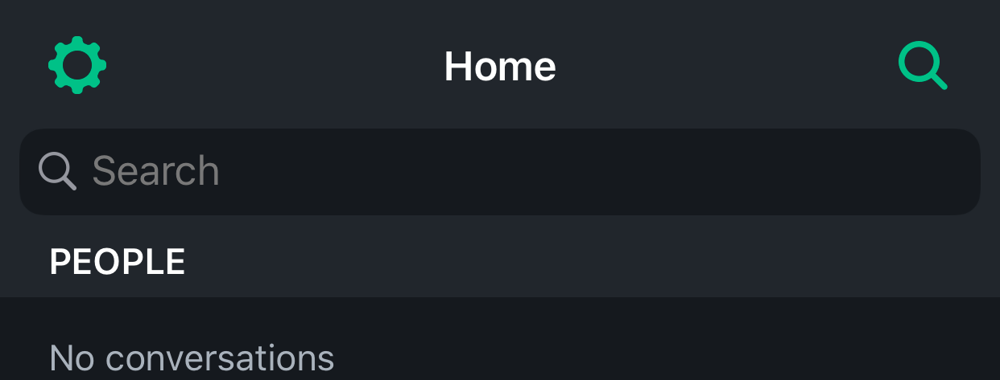

1. Tap `Security` &#8595; 
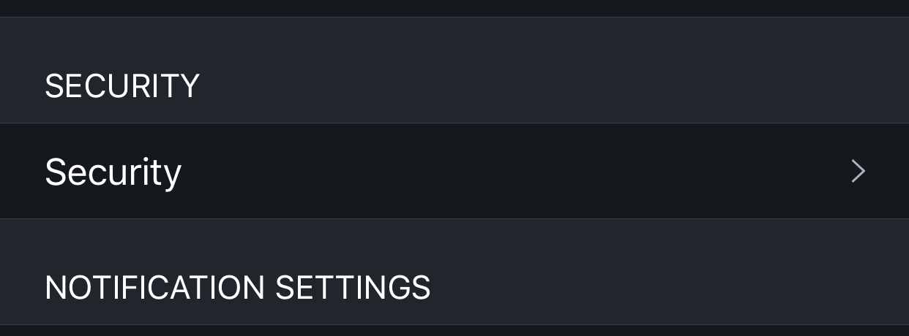

1. Tap `Export keys manually` &#8595; 
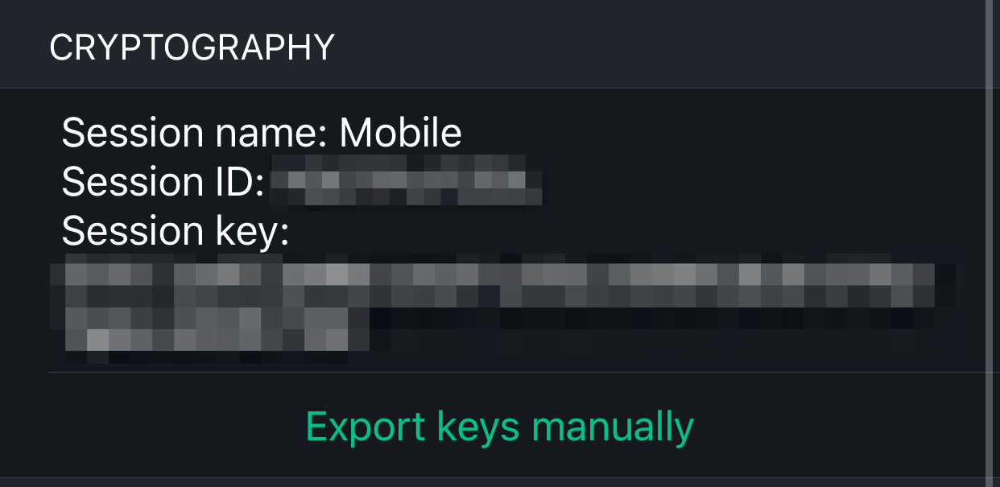

1. Enter a secure passphrase and tap `Export` &#8595; 
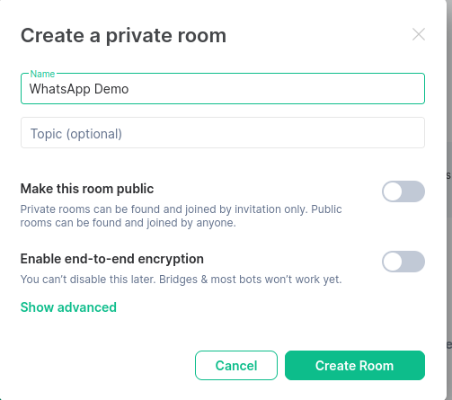

1. Choose `Save to Files` &#8595; 

1. Choose a location then tap `Save` &#8595; 

## Import iOS

This is a temporary solution until [this issue](https://github.com/vector-im/element-ios/issues/1027) is resolved

1. Tap the `+` in the bottom right corner &#8595; 
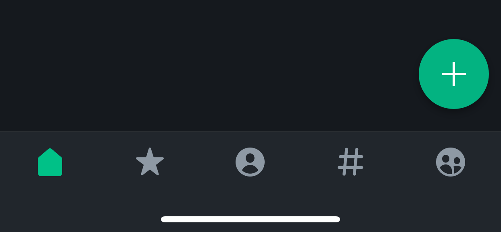

1. Tap `Create room` &#8595; 
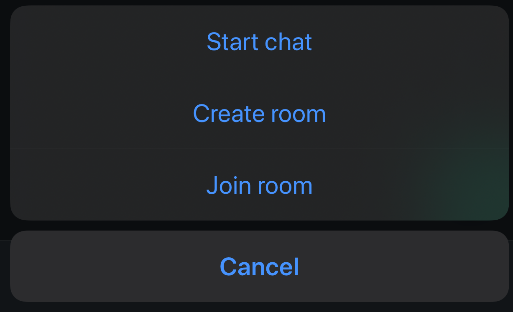

1. Tap the room name (Empty room) at the top &#8595; 
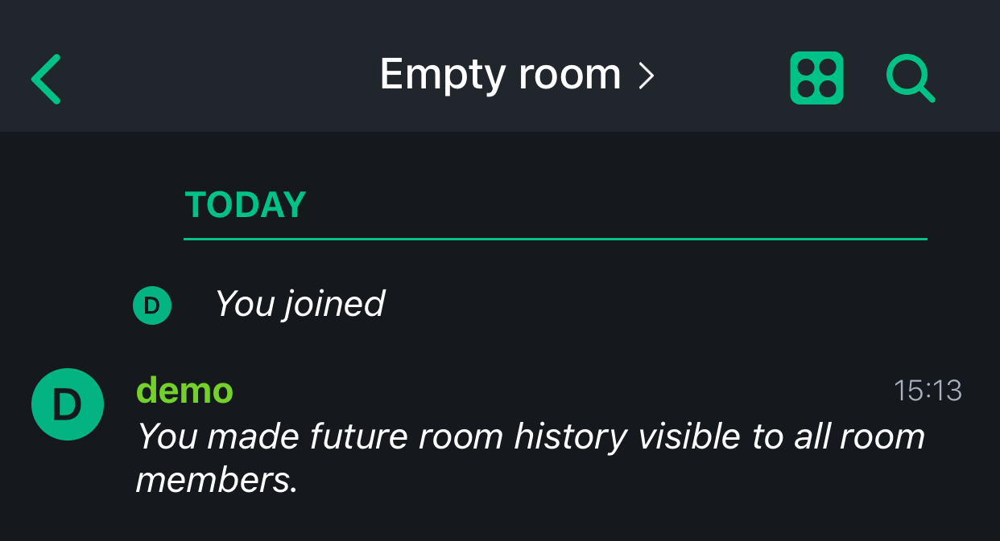

1. Tap the room name again &#8595; 

1. Under Advances, enable encryption &#8595; 
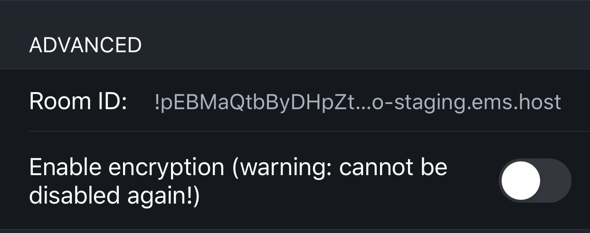

1. Tab `Done` in the top right &#8595; 

1. Tab the `+` to send a file &#8595; 
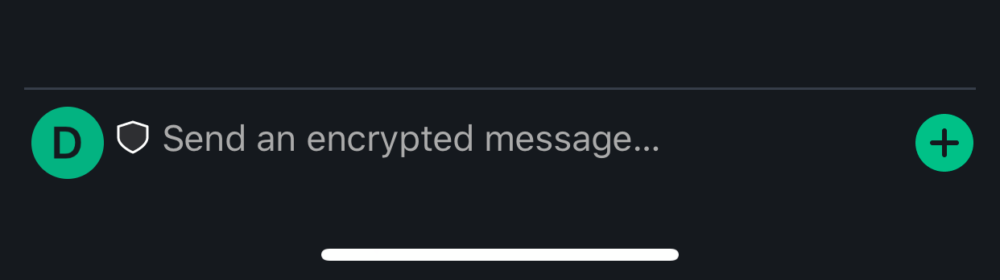

1. Tap `Send file` &#8595; 

1. Browse to and select your export &#8595; 
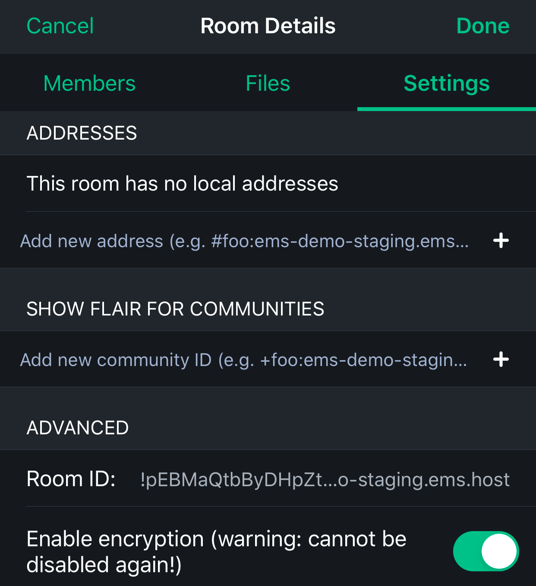

1. Tap the file you just sent &#8595; 
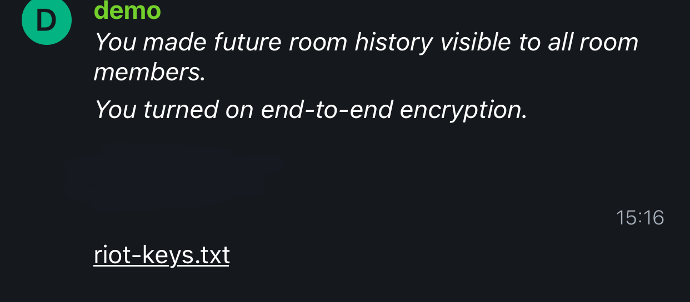

1. Tap `Import` &#8595; 
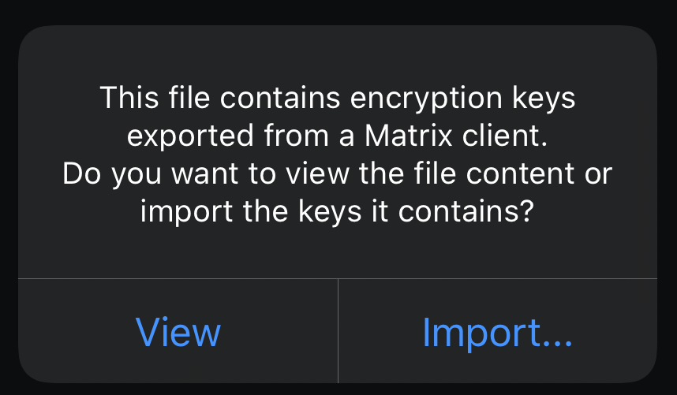

1. Enter your passphrase and tap `Import` &#8595; 
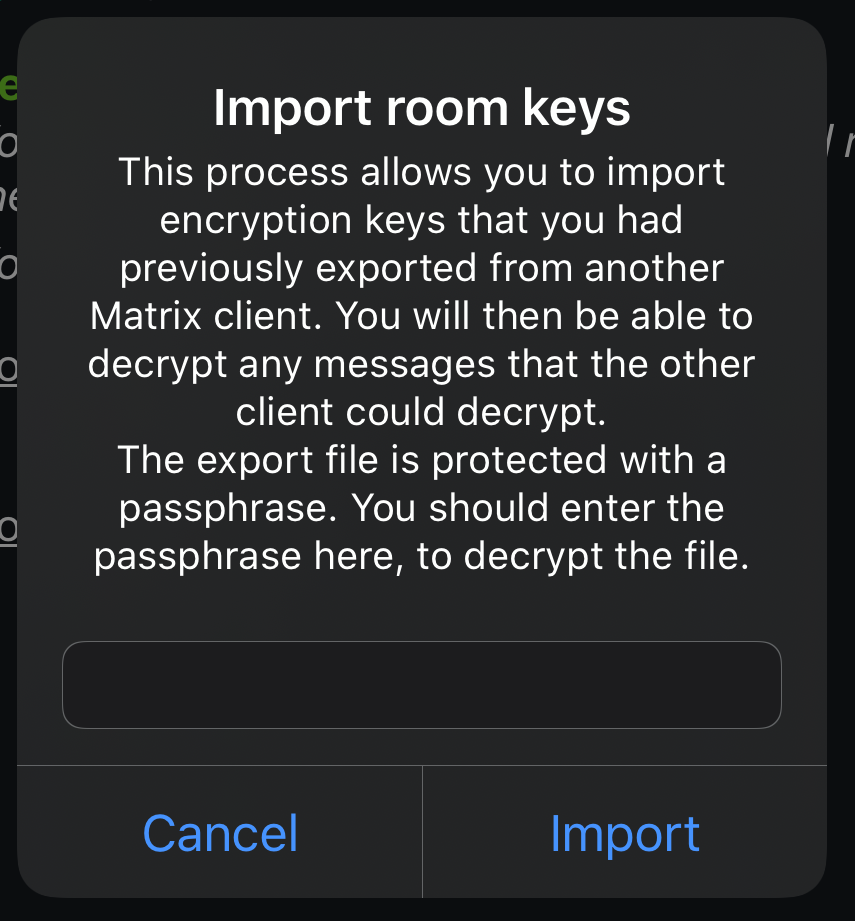

# Element and RiotX Android

## Export Android

1. Tap your uer picture in the top right &#8595; 
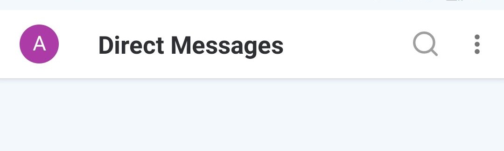

1. Tap the cog &#8595; 
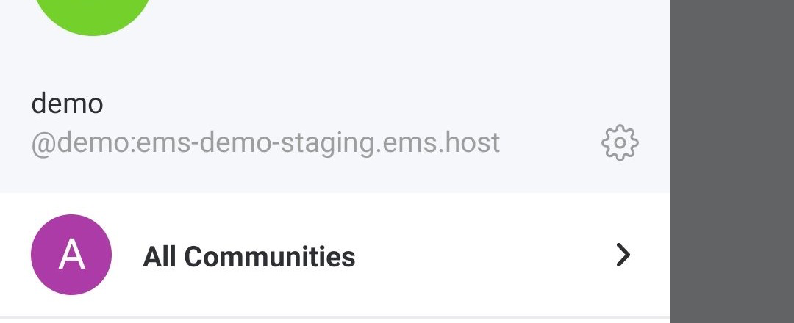

1. Tap `Security & Privacy` &#8595; 
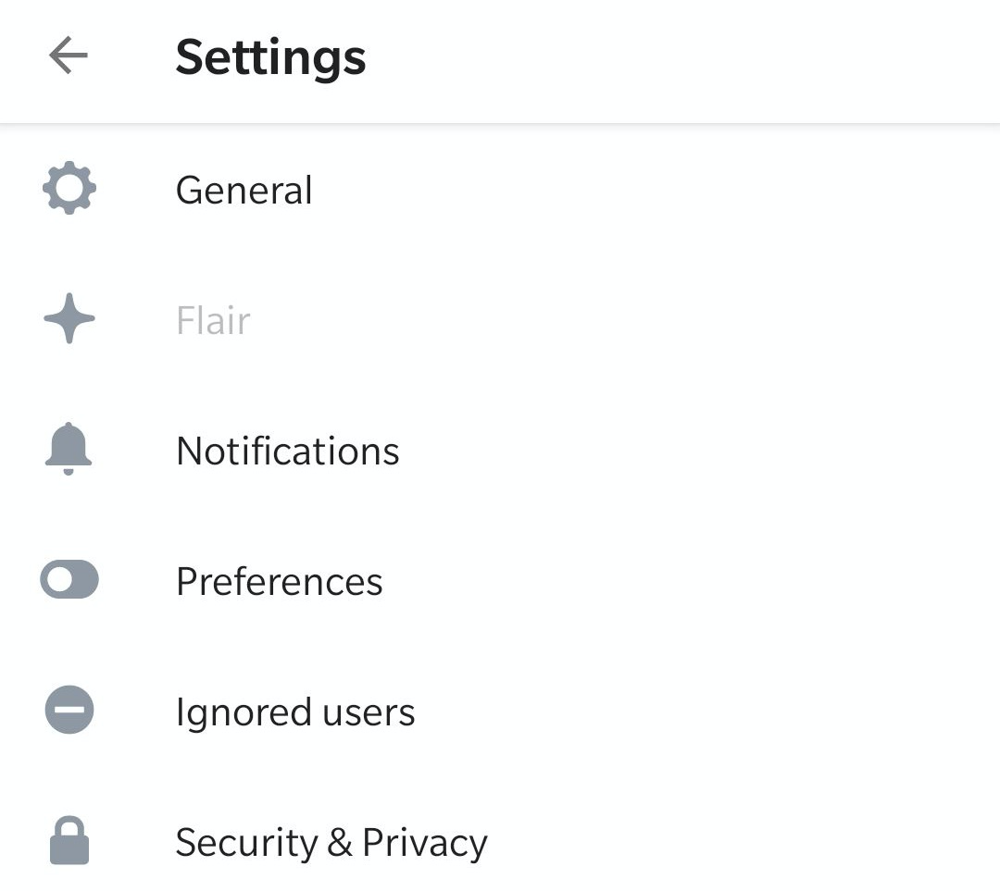

1. Tap `Export E2E room keys` &#8595; 
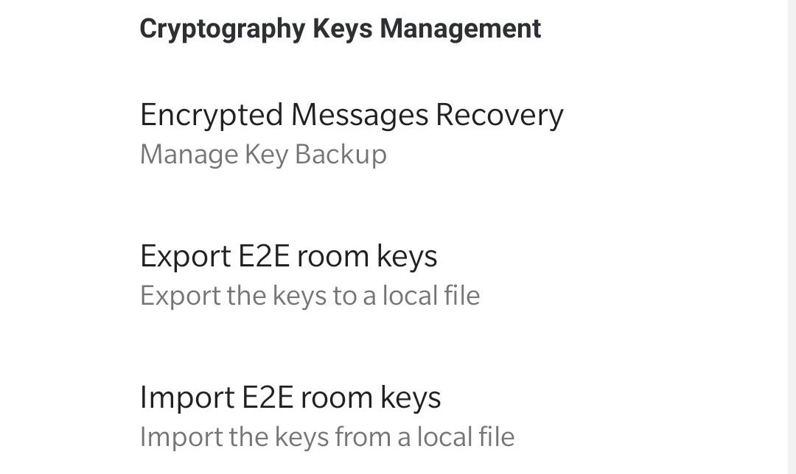

1. Select a location and a file name, then tap `SAVE` &#8595; 
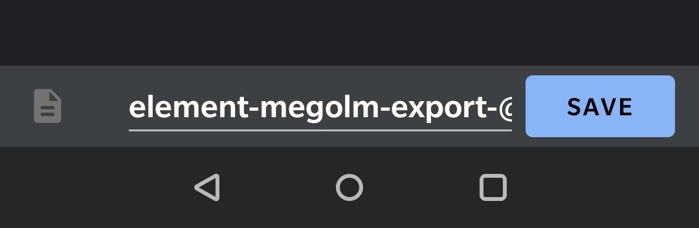

1. Enter a secure passphrase, then tap `EXPORT` &#8595; 

## Import Android

1. Tap your uer picture in the top right &#8595; 

1. Tap the cog &#8595; 

1. Tap `Security & Privacy` &#8595; 

1. Tap `Import E2E room keys` &#8595; 

1. Browse to and select your export &#8595; 
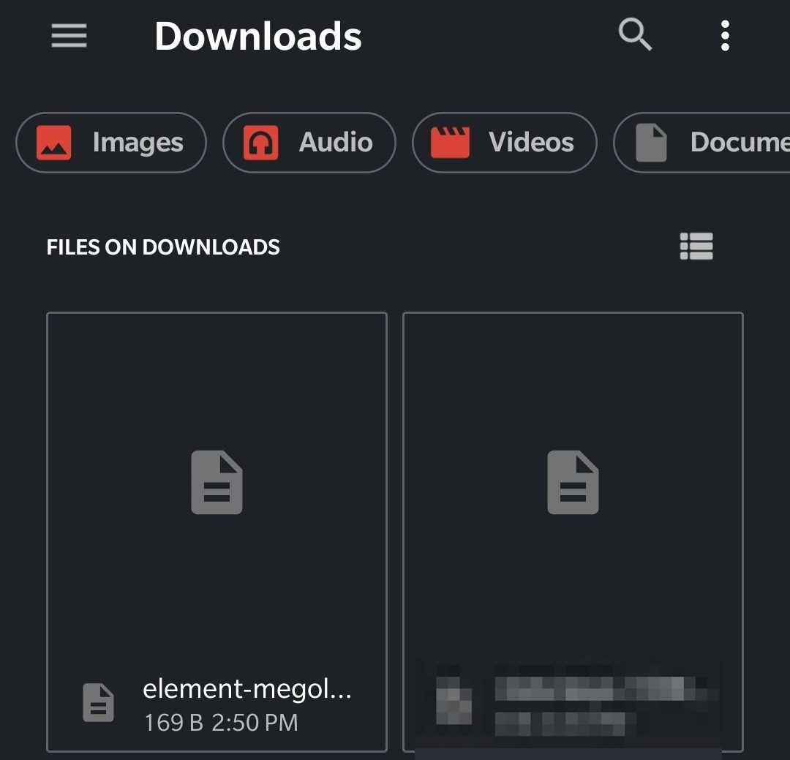

1. Enter your passphrase and tap `IMPORT` &#8595; 
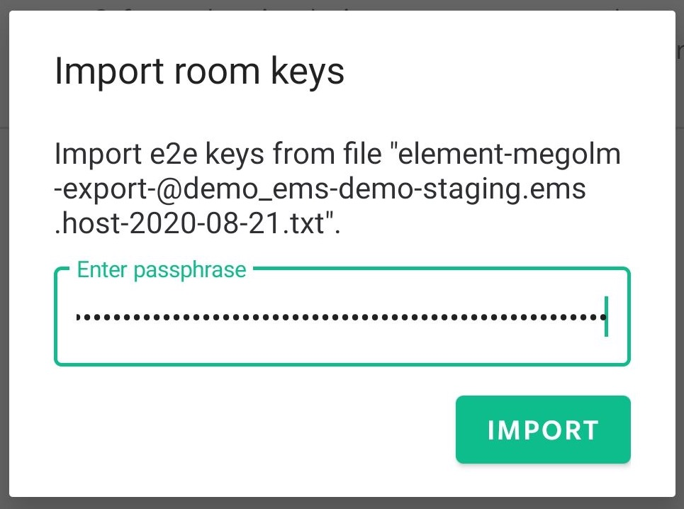
