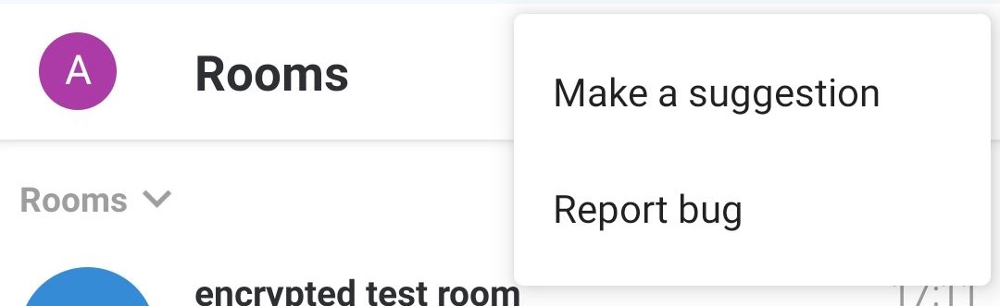
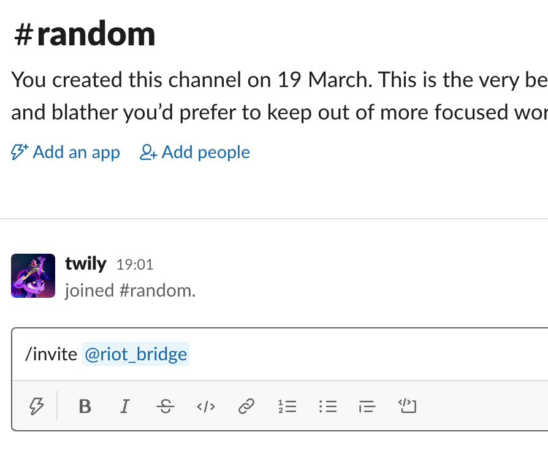

# Submit Debug Logs

This article is licensed under the standard MIT license. See [Home](index.md) for a full copy.

1. Search for other issues of the same problem on
    * Element Web and Desktop: [https://github.com/vector-im/element-web/issues](https://github.com/vector-im/element-web/issues)
    * Element iOS: [https://github.com/vector-im/element-ios/issues](https://github.com/vector-im/element-ios/issues)
    * Element Android: [https://github.com/vector-im/element-android/issues](https://github.com/vector-im/element-android/issues)

1. If you cannot find any, create one by clicking `New issue`, then `Get started` in the `Bug report` section.  &#8595; 
  

1. Go to the section for your device

<!-- TOC -->

- [Element Web and Desktop](#element-web-and-desktop)
- [Element iOS](#element-ios)
- [Element Android](#element-android)

<!-- /TOC -->

# Element Web and Desktop

1. Go to Element `All settings` &#8595; 
     &#8595; Under `Help & About`, click `Submit debug logs` &#8595; 
    

1. Enter a GitHub issue link and a description. Then click `Send logs` &#8595; 

1. Click `OK` &#8595; 

# Element iOS

1. Tap the cog in the top left of Element &#8595; 

1. Scroll down to the `OTHER` section, then tap `Report bug` &#8595; 

1. Enter a GitHub issue link and a description, make sure `Send logs` is checked, then click `Send` &#8595; 

# Element Android

1. Tap the three stacked dots in the top right &#8595; 

1. Tap `Report bug` &#8595; 

11. Enter a GitHub issue link and a description, make sure `Send logs`, amd `Send crash logs` are checked, then tap the send arrow in the top right &#8595; 

