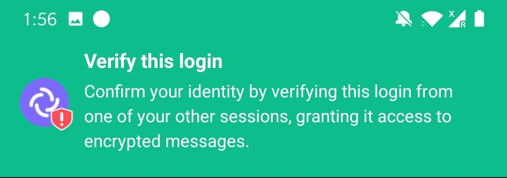
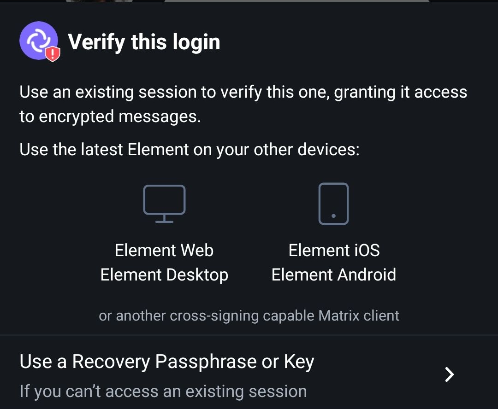
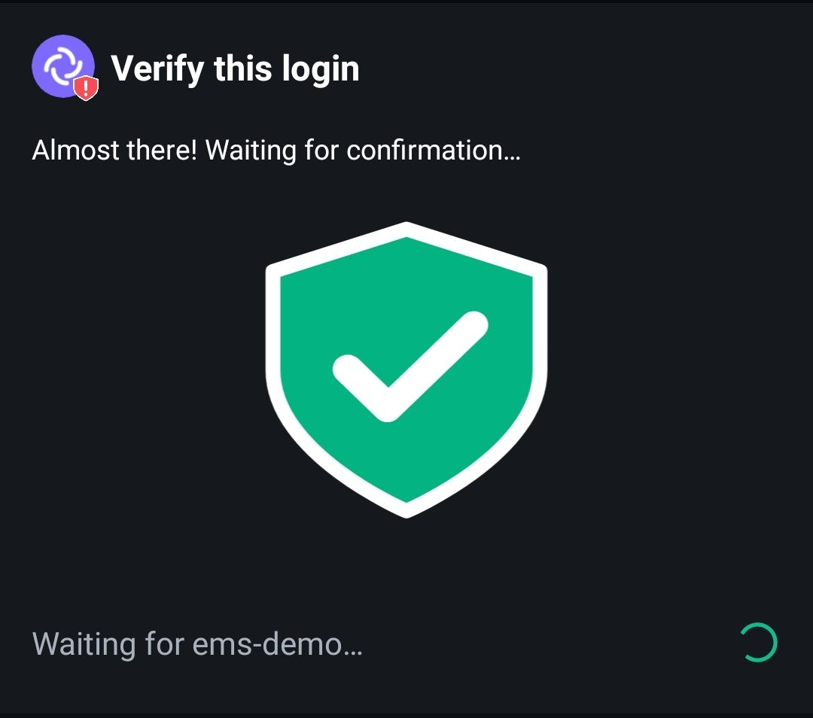

# Verify new Login

When you log in to a new device/session, you must verify the login and connect it to cross signing and secret storage to access your backed up encryption keys for historical messages. This assumes you already have configured cross signing, see [Set up Cross Signing](Set-up-Cross-Signing.md).

1. Log in to Element with your username and password  

1. Choose one of the methods below for cross signing

## Compare emojis using another login

1. Click `Use another login`  

1. On another device/session that is connected to cross signing, click `Accept`  

1. Click `Start`

1. Compare the emojis on your new and old sessions. They should be the same emojis and in the same order. Click `They match` on both sessions  

1. If all was successful, you should get this green shield on both sessions. Click `Got it`. Your new device/session is now verified and will download your backed up message encryption keys  

## Scan QR code on another login

Login is here demonstrated on Element Android

1. On your phone, tap `Verify this login`  

1. Your phone is now waiting for you to accept from another device  

1. On another device/session that is connected to cross signing, click `Accept`  

1. On your phone, tab `Scan with this device`  

1. Using your phone, scan the QR code shown on your other session  
  

1. Your phone waits for you to confirm green shield on your other session. Click `Yes`  
  

1. Tap `Done` on your phone  

1. If all was successful, you should get this green shield on both sessions. Click `Got it`. Your new device/session is now verified and will download your backed up message encryption keys  

## Using your Security Key

1. Click `Use Security Key`  

1. Enter your Security key when prompted and click `Continue`  

1. If all was successful, you should get this green shield on both sessions. Click `Got it`. Your new device/session is now verified and will download your backed up message encryption keys  

